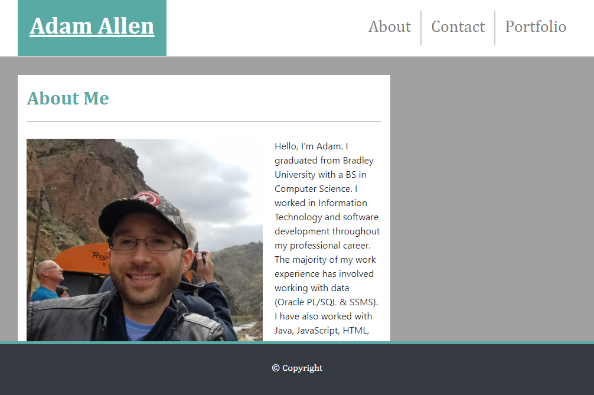

# Portfolio

Link to repo: <https://github.com/locutusOO1/portfolio>

Link to page: <https://locutusoo1.github.io/portfolio/>

## Summary
This project is about creating a responsive portfolio which makes use of the Bootstrap CSS Framework. Bootstrap allows this website to be mobile responsive while keeping the number of media queries to a minimum.

This portfolio includes:
* Pages: About(index.html), Contact(contact.html), and Porfolio(portfolio.html)
* HTML for layout
* CSS for style
* Bootstrap for responsive design

## Screenshot
